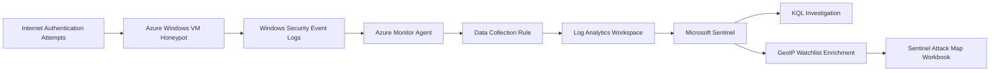

# Azure Security Operations & Threat Detection Lab

## Overview

This project demonstrates a basic cloud-based Security Operations workflow using Microsoft Azure and Microsoft Sentinel.

I built a controlled honeypot environment by deploying a Windows 10 virtual machine in Azure and intentionally exposing it to the internet for security monitoring practice. Failed authentication attempts were collected from the VM, forwarded into a Log Analytics Workspace, analyzed with KQL, enriched with geographic IP data, and visualized in Microsoft Sentinel using a custom attack map workbook.

The purpose of this lab was to practice core SOC analyst skills, including log collection, SIEM configuration, failed login investigation, IP enrichment, detection logic, and security event visualization.

> **Security Note:**  
> This VM was intentionally exposed as a controlled honeypot for lab purposes only. It contained no sensitive data, used disposable credentials, and was deleted after testing to reduce cost and security risk.

---

## Portfolio Context

This project supports my SOC Analyst Technical Assessment portfolio by providing hands-on evidence of log collection, Microsoft Sentinel configuration, KQL-based investigation, and failed authentication analysis.

The findings from this lab can be used as a practical case study for SIEM alert triage, Event ID 4625 investigation, MITRE ATT&CK mapping, and SOC reporting.

## Project Objectives

- Deploy a Windows VM honeypot in Microsoft Azure
- Configure Microsoft Sentinel with a Log Analytics Workspace
- Collect Windows Security Events using Azure Monitor Agent
- Investigate failed login attempts using Event ID 4625
- Query security logs using Kusto Query Language
- Enrich source IP addresses with geographic data using a Sentinel watchlist
- Build a Microsoft Sentinel Workbook to visualize attack origins
- Practice basic SOC investigation and cloud threat detection workflows

---

## Tools & Technologies Used

- Microsoft Azure
- Microsoft Sentinel
- Log Analytics Workspace
- Azure Monitor Agent
- Data Collection Rules
- Windows Security Events
- Kusto Query Language
- Sentinel Watchlists
- Sentinel Workbooks
- Remote Desktop Protocol
- Windows 10 VM

---

## Skills Demonstrated

- Cloud security monitoring
- SIEM configuration
- Windows event log analysis
- Failed authentication investigation
- KQL querying
- Threat enrichment
- Attack visualization
- Basic detection engineering
- SOC workflow documentation

---

## Architecture



---

## Detection Focus

This lab focused on identifying failed authentication activity against an internet-facing Windows VM.

### Primary Event ID

| Event ID | Description |
|---|---|
| 4625 | Failed Windows logon attempt |

### MITRE ATT&CK Mapping

| Technique | Description |
|---|---|
| T1110 | Brute Force |
| T1021.001 | Remote Services: Remote Desktop Protocol |
| T1078 | Valid Accounts, if valid credentials are successfully used |

---

## Lab Walkthrough

---

## Step 1: Set Up Azure Subscription

I created an Azure subscription and accessed the Azure Portal to begin building the lab environment.

Azure sign-up page:  
https://azure.microsoft.com/en-us/pricing/purchase-options/azure-account

Azure Portal:  
https://portal.azure.com

<p align="left">
Azure sign-up page: <br/>

</p>

> **Cost Note:**  
> If using a paid subscription, make sure all resources are deleted after the lab to avoid unnecessary charges.

---

## Step 2: Create the Azure Honeypot VM

I created a Resource Group, Virtual Network, and Windows 10 Virtual Machine to act as the honeypot endpoint.

### Resource Group Creation

<p align="left">
Create Resource Group: <br/>

<br/><br/>
Choose subscription, resource group name, and region: <br/>

</p>

### Virtual Network Creation

<p align="left">
Search for Virtual Network: <br/>

<br/><br/>
Create Virtual Network: <br/>

<br/><br/>
Configure subscription, resource group, name, and region: <br/>

</p>

### Virtual Machine Creation

<p align="left">
Search for Virtual Machines: <br/>

<br/><br/>
Create Azure Virtual Machine: <br/>

<br/><br/>
Configure subscription, resource group, VM name, and region: <br/>

<br/><br/>
Select Windows 10 Pro image and VM size: <br/>

<br/><br/>
Create local administrator credentials: <br/>

<br/><br/>
Confirm licensing and proceed to disk configuration: <br/>

<br/><br/>
Configure OS disk settings: <br/>

<br/><br/>
Attach the VM to the virtual network: <br/>

<br/><br/>
Enable deletion of public IP and NIC when the VM is deleted: <br/>

<br/><br/>
Review and create the VM: <br/>

<br/>

</p>

---

## Step 3: Configure the Honeypot Exposure

To generate security events for analysis, I modified the Network Security Group to allow inbound traffic and then disabled the Windows Firewall inside the VM.

> **Important:**  
> This configuration should only be used in an isolated lab. It is not suitable for production environments.

### Network Security Group Configuration

<p align="left">
Open the Network Security Group from the Resource Group: <br/>

<br/><br/>
Remove the default inbound rule blocking traffic: <br/>

<br/><br/>
Create a new inbound security rule: <br/>

<br/><br/>
Allow inbound traffic for lab testing: <br/>

<br/><br/>
Set rule priority and name: <br/>

</p>

### Remote Desktop Access

<p align="left">
Copy the VM public IP address: <br/>

<br/><br/>
Connect using Remote Desktop: <br/>

<br/>

<br/><br/>
Enter the VM username and password: <br/>

<br/>

</p>

### Windows Firewall Configuration

Inside the VM, I opened `wf.msc` and disabled the Windows Defender Firewall for Domain, Private, and Public profiles.

<p align="left">
Open Windows Defender Firewall settings: <br/>

<br/><br/>
Test connectivity to the VM using ping: <br/>

<br/>

</p>

---

## Step 4: Generate and Inspect Failed Logon Events

To create test security events, I attempted several failed logins against the VM using an invalid username.

After logging back into the VM, I opened Event Viewer and reviewed the Windows Security logs.

The failed login attempts appeared as:

```text
Event ID: 4625
Description: An account failed to log on
```

<p align="left">
Failed login event evidence in Event Viewer: <br/>

<br/>

<br/>

<br/>

</p>

This confirmed that the VM was generating useful authentication logs before forwarding them into Microsoft Sentinel.

---

## Step 5: Configure Log Analytics Workspace and Microsoft Sentinel

Next, I created a Log Analytics Workspace to act as the central log repository, then enabled Microsoft Sentinel on top of the workspace.

### Log Analytics Workspace

<p align="left">
Search for Log Analytics Workspaces: <br/>

<br/><br/>
Create Log Analytics Workspace: <br/>

<br/><br/>
Configure subscription, resource group, workspace name, and region: <br/>

<br/>

</p>

### Microsoft Sentinel Setup

<p align="left">
Search for Microsoft Sentinel and create a Sentinel instance: <br/>

<br/>

<br/><br/>
Select the Log Analytics Workspace and add Sentinel: <br/>

</p>

---

## Step 6: Configure Windows Security Events Collection

I configured the **Windows Security Events via AMA** connector in Microsoft Sentinel.

This created a Data Collection Rule that collected Windows Security Events from the VM and forwarded them to the Log Analytics Workspace.

<p align="left">
Open Content Hub and select Windows Security Events: <br/>

<br/><br/>
Open Windows Security Events via AMA connector: <br/>

<br/>

<br/><br/>
Create Data Collection Rule: <br/>

<br/>

<br/><br/>
Collect all Security Events: <br/>

<br/><br/>
Verify extension installation on the VM: <br/>

</p>

---

## Step 7: Query Security Events with KQL

After logs were collected, I queried the Log Analytics Workspace using KQL.

### Basic Failed Logon Query

```kql
SecurityEvent
| where EventID == 4625
```

### Investigation Query

```kql
SecurityEvent
| where EventID == 4625
| project TimeGenerated, Account, Computer, IpAddress, Activity, LogonTypeName
| order by TimeGenerated desc
```

### Failed Logons by Source IP

```kql
SecurityEvent
| where EventID == 4625
| where isnotempty(IpAddress)
| summarize FailedLogonAttempts = count() by IpAddress
| order by FailedLogonAttempts desc
```

### Failed Logons by Account and Source IP

```kql
SecurityEvent
| where EventID == 4625
| summarize FailedAttempts = count() by Account, IpAddress
| order by FailedAttempts desc
```

### Failed Logon Timeline

```kql
SecurityEvent
| where EventID == 4625
| summarize FailedAttempts = count() by bin(TimeGenerated, 1h)
| order by TimeGenerated asc
```

These queries helped identify failed login patterns, targeted accounts, source IP addresses, and authentication activity over time.

---

## Step 8: Enrich Logs with Geographic Data

The raw Windows Security Events contained source IP addresses but did not include geographic location data.

To enrich the logs, I imported a GeoIP dataset as a Microsoft Sentinel Watchlist.

GeoIP dataset used in the lab:  
https://drive.google.com/file/d/1akZFLmTWRxHECPQaYIHnIfTwPZTctRnz/view?usp=sharing

### Watchlist Configuration

| Setting | Value |
|---|---|
| Name / Alias | geoip |
| Source Type | Local File |
| Number of lines before row | 0 |
| Search Key | network |

After the watchlist was imported, I was able to correlate source IP addresses with geographic data and use that enrichment in the Sentinel Workbook.

Example enrichment concept:

```kql
let GeoIPDB = _GetWatchlist("geoip");
SecurityEvent
| where EventID == 4625
| where isnotempty(IpAddress)
| evaluate ipv4_lookup(GeoIPDB, IpAddress, network)
| project TimeGenerated, Account, IpAddress, latitude, longitude, cityname, countryname
```

---

## Step 9: Create the Microsoft Sentinel Attack Map

I created a Microsoft Sentinel Workbook to visualize failed authentication attempts by geographic location.

Workbook JSON used in the lab:  
https://drive.google.com/file/d/1FLUIkzdbk4ypYg-OEza9e4ZJ9w7kYnu7/view?usp=sharing

### Workbook Steps

1. Open Microsoft Sentinel
2. Go to Workbooks
3. Create a new Workbook
4. Remove the default elements
5. Add a Query element
6. Open the Advanced Editor
7. Paste the workbook JSON
8. Save and run the Workbook
9. Review the attack map visualization

The attack map provided a visual summary of where failed login attempts originated.

---

## Results

This lab successfully demonstrated a basic SOC monitoring workflow in Azure.

### What Was Achieved

- Built an internet-facing Azure Windows VM honeypot
- Generated failed authentication activity
- Confirmed Event ID 4625 logs in Windows Event Viewer
- Forwarded Windows Security Events into Log Analytics Workspace
- Connected Microsoft Sentinel to the workspace
- Queried failed login events using KQL
- Enriched source IP addresses using a Sentinel watchlist
- Created an attack map workbook to visualize authentication activity

---

## Key Learnings

- Microsoft Sentinel can be used to collect, investigate, enrich, and visualize Windows security events
- Event ID 4625 is useful for identifying failed authentication attempts
- Azure Monitor Agent and Data Collection Rules are important parts of the log ingestion pipeline
- KQL is essential for SOC investigations and threat detection in Microsoft Sentinel
- Watchlists can enrich security data and improve investigation context
- Honeypots must be isolated, disposable, and removed after testing
- Strong documentation helps turn a lab into portfolio evidence

---

## Cleanup

To reduce cost and security exposure, I deleted the lab resources after testing.

Resources removed:

- Windows VM
- Public IP address
- Network Security Group
- Log Analytics Workspace
- Microsoft Sentinel instance
- Resource Group

---

## Project Status

Completed.

Future improvements may include:

- Adding Sentinel analytic rules
- Creating incident automation playbooks
- Adding alert severity logic
- Mapping detections to MITRE ATT&CK
- Adding Defender for Cloud recommendations
- Expanding the lab to include multiple log sources
